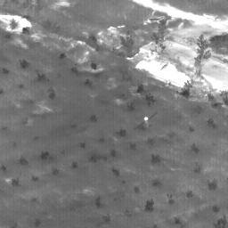
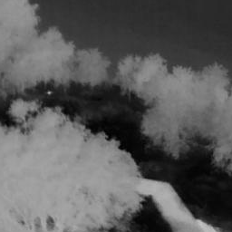

# CGRCA

Centroid-Guided Regional Clustering Annotation - For infrared small target

## DatasetA

| ​**Original image** | ​**Pre-mask** | ​**DBSCAN-mask** |
|:---:|:---:|:---:|
|  |  |  |

## DatasetB

| ​**Original image** | ​**Pre-mask** | ​**DBSCAN-mask** |
|:---:|:---:|:---:|
|  |  |  |

```bash

CGRCA/
├── data/
│   ├── datasetX/
│   │   ├── img/                   # Raw images
│   │   ├── mask-dbscan/           # DBSCAN processed masks
│   │   └── mask-pre/              # Initial masks (centroid annotations)
│   └── datasetY/                  # Same structure as datasetX
├── main.py                        # Core processing script
└── requirements.txt               # Dependency list

```

## Install dependencies

```bash
pip install -r requirements.txt
```

## Run processing script (default: datasetA)

```bash
python main.py
```

## Core parameter configuration (modify at end of main.py)

```python
batch_process_dataset(
    base_dir=dataset_root,
    eps_values=[55],          # DBSCAN neighborhood radius
    min_samples_list=[100],   # Minimum samples threshold
    window_radius=10,         # Analysis window radius
    core_radius=4             # Core processing radius
)
```

## Supported image formats

```text
Extensions: .png, .jpg, .jpeg, .bmp
```

## Mask naming convention

```text
Original image: datasetX/img/1.png
Corresponding mask: datasetX/mask-pre/1.png
Output path: datasetX/mask-dbscan/minsamples_x/eps-y/1.png
```

## License

MIT License

Copyright (c) 2025 wenzhen

Permission is hereby granted, free of charge, to any person obtaining a copy
of this software and associated documentation files (the "Software"), to deal
in the Software without restriction, including without limitation the rights
to use, copy, modify, merge, publish, distribute, sublicense, and/or sell
copies of the Software, and to permit persons to whom the Software is
furnished to do so, subject to the following conditions:

The above copyright notice and this permission notice shall be included in all
copies or substantial portions of the Software.

THE SOFTWARE IS PROVIDED "AS IS", WITHOUT WARRANTY OF ANY KIND, EXPRESS OR
IMPLIED, INCLUDING BUT NOT LIMITED TO THE WARRANTIES OF MERCHANTABILITY,
FITNESS FOR A PARTICULAR PURPOSE AND NONINFRINGEMENT. IN NO EVENT SHALL THE
AUTHORS OR COPYRIGHT HOLDERS BE LIABLE FOR ANY CLAIM, DAMAGES OR OTHER
LIABILITY, WHETHER IN AN ACTION OF CONTRACT, TORT OR OTHERWISE, ARISING FROM,
OUT OF OR IN CONNECTION WITH THE SOFTWARE OR THE USE OR OTHER DEALINGS IN THE
SOFTWARE.
